# Learning-Based Vibration Frequency Estimation via Video Motion Magnification

**Date:** 2025/06/22

**Author:** HyeonGyu Seo, Joungbin Choi

**Github:** [GitHub Link](https://github.com/Joungbin-C/DLIP/tree/main/Final_Project)

**Demo:** [Video](https://youtu.be/PCO9mDneWYE)

## Introduction

Vibration is a critical indicator of the health and performance of mechanical systems. Traditionally, vibration analysis in industrial and structural applications relies on physical sensors such as accelerometers. While these sensors offer precise measurements, they also come with limitations—such as installation difficulty in confined or hazardous environments, sensitivity to noise, and limited coverage for large or complex systems.

Recently, video-based vibration analysis has emerged as a promising non-contact alternative. However, standard image processing techniques often struggle to detect subtle or high-frequency vibrations due to limited temporal resolution. To address this, motion magnification techniques can be applied to amplify small movements in video frames, making otherwise imperceptible vibrations visible.

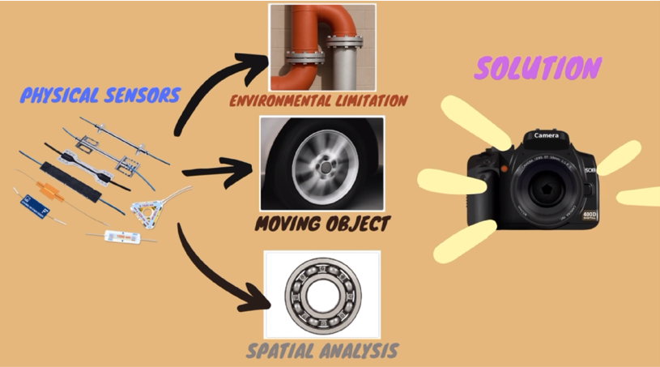

In this project, we propose an AI-based framework for estimating vibration frequency from magnified videos. We collect vibrating video data alongside ground truth frequency measurements from an accelerometer for supervised training. The final system aims to estimate the vibration frequency of a target structure and determine whether the system is operating in a normal or abnormal state—all without the need for direct sensor contact.


## Problem Statements

Traditional vibration analysis commonly relies on physical sensors such as accelerometers or microphones. While these sensors are effective in many scenarios, they encounter several critical limitations in real-world industrial environments:

1. **Noise Sensitivity**
   - Audio-based sensors are vulnerable to ambient noise and are ineffective in isolating the vibration of a specific component within a complex system.
2. **Environmental Constraints**
   - Physical sensors are difficult to install in environments with high temperatures, strong magnetic fields, structural limitations, or confined spaces.
   - Mobile or rotating parts also pose challenges for sensor attachment and data collection.
3. **Localization Limitations**
   - It is difficult to analyze the vibration of a single part within a machine using traditional sensors, especially when other components are simultaneously vibrating.
4. **Cost and Accessibility**
   - Advanced solutions such as high-speed or high-resolution cameras are often too expensive and impractical for widespread deployment.


## Goal of Project & Target Customers

#### **A. Goal of project**

To solve the problems mentioned in the problem statement, we want to analyze vibrations using cameras and deep learning models. This will allow us to predict the possibility of failure and prevent plant losses.

There are **two main parts** to be implemented in this project.

1. **Magnification Model**: Implement a model for vibration magnification.
2. **Visualization & Detect Vibration**: Analyze the vibrations using classical image processing techniques on the magnified videos.

#### **B. Target Performance**

1. Magnification model

   The goal of our project is to utilize camera-based Deep Learning models for vibration analysis. In particular, the key is to amplify microscopic vibrations in images to detect failures before they occur. To this end, we quantitatively evaluate the model performance based on two key metrics: Peak Signal-to-Noise Ratio (PSNR) and Structural Similarity Index (SSIM).

   - **PSNR (Peak Signal-to-Noise Ratio)**

     * Target value: 10-frame average **PSNR > 25.0 dB**

     * Evaluation method

       Use the amplified image frame generated by the **optical flow-based algorithm** as the Ground Truth (GT). Compare the `Y_hat`frame, which is the output of our deep learning-based amplification model, with the `GT` frame to calculate the **PSNR** per frame. Select 10 frames from the entire evaluation frame to calculate the average **PSNR**.

     * Meaning
       PSNR measures the pixel similarity between the original `GT` and the model prediction `Y_hat`. A higher value means a smaller error and better quality

   - **SSIM (Structural Similarity Index)**

     * Target value: 10-frame average **SSIM > 0.9**

     * Evaluation method

       In the same way as PSNR, **SSIM** between Optical Flow-based `GT` and `Y_hat` is calculated frame by frame. Similarly, the average **SSIM** of 10 frames is calculated.

     * Meaning
       SSIM is an index that comprehensively considers the brightness, contrast, and structural similarity of the image, and can be used to determine how close it is to the original structurally. It is a value between 0 and 1, and the closer it is to 1, the more similar it is to the original.

2. Visualization & Detect vibration

   * **XT-Slice Visualization & Image Processing**

     Generate **XT-Slice** images of specific regions of interest (ROI) based on the amplified images. **XT-Slice** analyzes the pattern of pixel intensity over time to identify periodicity or abnormal vibrations.

     * Detected edges and peaks in **XT-Slice**
     * Classified normal/warning/emergency states based on **peak count**

#### **C. Target Customers:**

* Smart Factory Integrators – for condition monitoring of machines in automated manufacturing environments
* Plant Maintenance Service Providers – where large-scale equipment needs frequent non-invasive inspection
* Robot Health Diagnostics Companies – enabling remote or visual-based state estimation for robots or mechatronic systems


## Requirement

* **Hardware**
  * Arduino R4 WIFI
  * DC motor(MB2430-0510F) & DC motor drive(L9110)
  * Accelerometer(ADXL345)
  * Steel Beam
* **Software Installation**
  * CUDA 10.1
  * cudatoolkit 10.1
  * Python 3.8.5
  * Pytorch 1.6.0
  * Torchvision==0.7.0

- **Anaconda Settings**

Check your cuda version and download [nvidia driver](https://developer.nvidia.com/cuda-toolkit-archive). Create your own virtual environments in  anaconda with following [installation guide](https://ykkim.gitbook.io/dlip/installation-guide/installation-guide-for-deep-learning).

```python
# create a conda env name=py39
conda create -n py39 python=3.9.12
conda activate py39
conda install -c anaconda seaborn jupyter
pip install opencv-python

# pytorch with GPU
conda install -c anaconda cudatoolkit==11.3.1 cudnn seaborn jupyter
conda install pytorch=1.10 torchvision torchaudio cudatoolkit=11.3 -c pytorch
pip install opencv-python torchsummary

# Check GPU in Pytorch
conda activate py39
python
import torch
print("cuda" if torch.cuda.is_available() else "cpu"
```

- **Hardware Setting**

To make a vibrating dataset, we create a vibrating beam structure. With Arduino, we control the DC motor driver, the DC motor, and an accelerometer. There is a load on the DC motor to create the vibration and accelerations are collecting. The pin map is right below. 


## Dataset

#### **A. Dataset Collection for Vibration Magnification Model**

To build a high-quality dataset for training a deep learning-based vibration magnification model, we conducted a controlled experiment with the following setup:

1. **Vibration Generation**

   A small DC motor is attached to a vertical cantilever beam to produce mechanical vibrations at various known frequencies. By controlling the motor input, we ensure consistent and measurable vibration conditions.

2. **Video Acquisition**

   A high-speed camera (≥60 fps) is used to record the vibrating beam, capturing subtle motion changes between frames. Each frame is saved as an individual image for training use.

3. **Generate Ground Truth image** 

   A classical **optical flow algorithm** is applied to pairs of consecutive frames to generate vibration-magnified reference frames. These optical-flow-based outputs serve as the ground truth `Y` for training the magnification model.


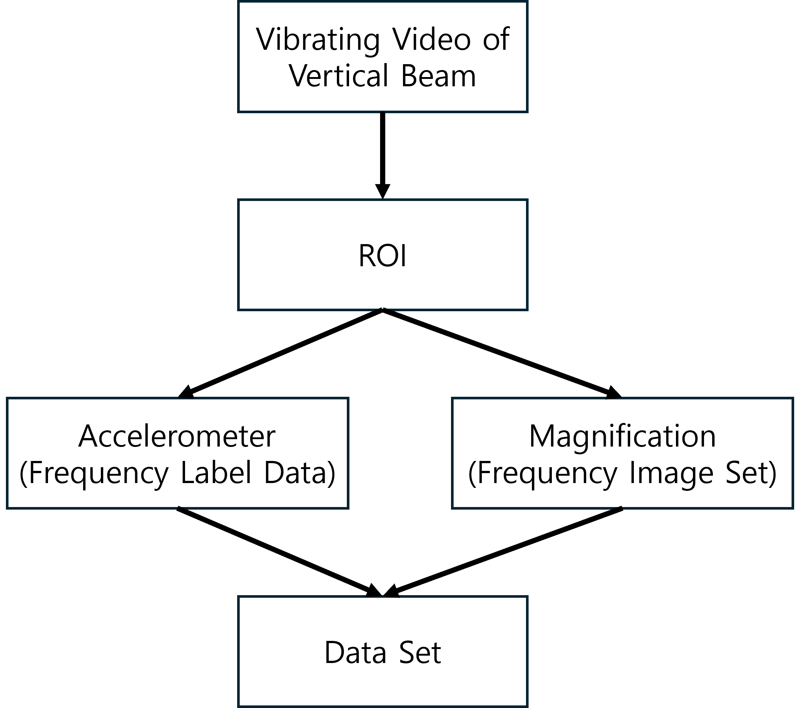

#### **B. Dataset Structure for Model Training.** 

To train the vibration magnification model, we structure the dataset as follows:  

- `Xa`: A frame at time t
- `Xb`: A frame at time t+1
- `Y (Ground Truth)`: The optical flow-based **magnified frame** between `Xa` and `Xb`

$$
{X_a,X_b}\rightarrow Y
$$

- The model is trained to **simulate motion magnification** purely from raw input frames.
- Optical flow is only used during **dataset preparation**, not during inference.

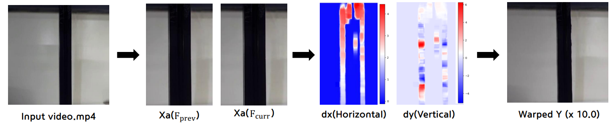


## Method

#### **A. Preprocessing**

* **ROI Extraction**: For each video, we selected a region of interest (ROI) focusing on the vibrating part (e.g., a vertical beam).
* **Motion Magnification**: We applied a trained deep CNN model to magnify subtle motions within the ROI.
* **Frequency Labeling**: Ground truth vibration frequencies were obtained using an accelerometer. The corresponding frequency was assigned to each frame or clip.

#### **B. Deep Learning Model**

* **Architecture**: The model consists of three parts:
  - **Encoder**: Extracts `shape` and `texture` representations from video frames
  - **Manipulator**: Amplifies motion using learned filters and a tunable magnification factor
  - **Decoder**: Reconstructs the motion-magnified frame from the manipulated representation

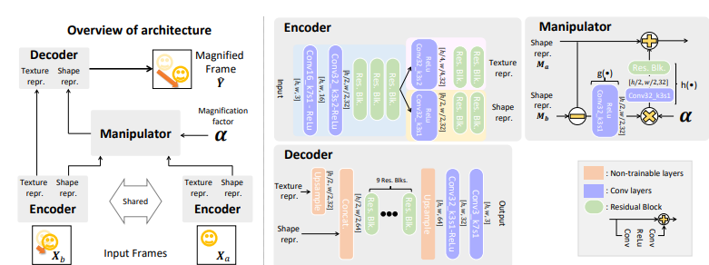


## Procedure

### 1. Create Dataset

In this project, we constructed training data by extracting frames from a video and generating motion-amplified targets (Y) through optical flow-based warping between each pair of neighboring frames. The process consists of three main steps.


1. Extract frames from the input video.

2. **Create Xa/Xb pairs** by selecting adjacent frames.

3. **Generate Y data** using optical flow and amplification:

   a. Compute **optical flow** between `Xa` and `Xb` using OpenCV’s **Farneback algorithm**.

   b. Amplify the flow by multiplying it by a scale factor (**sf**).

   c. Use PyTorch’s `grid_sample` to warp `Xa` with the scaled flow to generate the amplified output `Y`.

```python
cv2.calcOpticalFlowFarneback(prev, next, flow, pyr_scale, levels, winsize, iterations, poly_n, poly_sigma, flags) -> flow
```

|  Parameter   |                     Description                     |     Type      |
| :----------: | :-------------------------------------------------: | :-----------: |
| `pyr_scale`  |        Image scale for building the pyramid         | float, 0 to 1 |
|   `levels`   |              Number of pyramid levels               |      int      |
|  `winsize`   |             Window size for each pixel              |      int      |
| `iterations` |            Iterations per pyramid level             |      int      |
|   `poly_n`   | Size of pixel neighborhood for polynomial expansion |      int      |
| `poly_sigma` |          Std. dev. for Gaussian smoothing           |     float     |
|   `flags`    |                   Operation flags                   |      int      |


### 2. Train Motion Amplification Model

Network architecture- This model consists of three main parts:

1. **Encoder** : It acts as a spatially decomposed filter that extracts **shape representation (M)** and **texture representation (V)** from a single frame. This is similar to the phase or amplitude used in traditional phase-based methods.

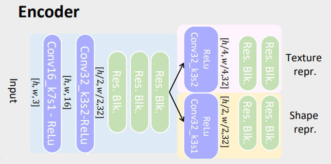

2. **Manipulator** : Takes the difference in the shape representation of two frames and directly multiplies it by a magnification factor (α) to magnify the movement. Nonlinearity is added to improve quality. Here, `g` and `h` are composed of Conv + ReLU and Conv + ResidualBlock, respectively.

$$
G_m(M_a, M_b, \alpha)=M_a+h(\alpha\cdot g(M_b-M_a))
$$

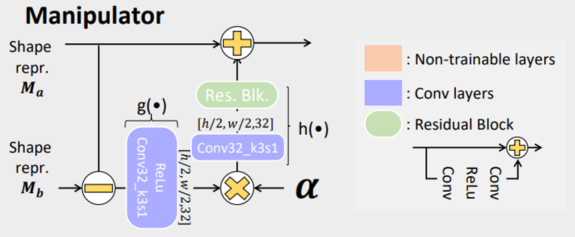

3. **Decoder** : Final image restoration using shape and texture representations amplified by the manipulator.

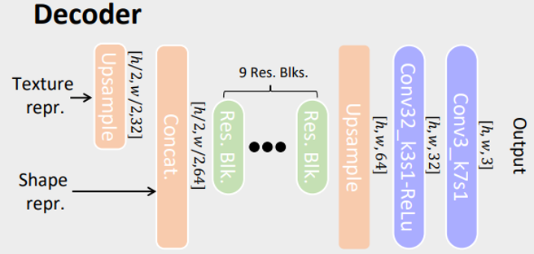

4. Overview architecture

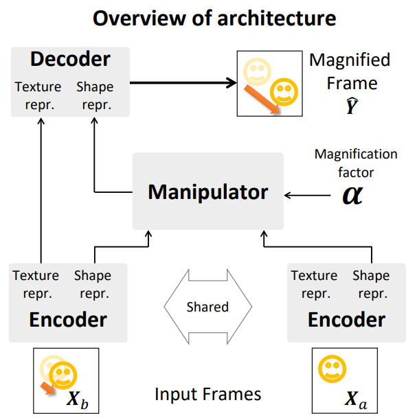

|     Component      |             Description              |                   Features                   |
| :----------------: | :----------------------------------: | :------------------------------------------: |
|    **Encoder**     | Image → Extract Shape(M), Texture(V) | Including Residual block, feature separation |
|  **Manipulator**   | Applying amplification factor α to M | Supporting both linear and nonlinear methods |
|    **Decoder**     | Generating Ŷ with amplified M and V  |                      -                       |
| **Residual Block** |   Preventing loss of  information    |       Conv-ReLU-Conv + Skip connection       |


### 3. Creating XT-Slice Image with Magnified Video

The X-T slice image is used to visually represent spatial changes over time. We creating that image using the `extract_xt_slice` function. This function extracts a horizontal region centered at a specified y-axis position with a defined height (`crop_height`) from each video frame. It then computes the median value along the vertical axis to produce a one-dimensional vector. By stacking these vectors from consecutive frames over time, a two-dimensional X-T image is constructed, where the x-axis represents space and the y-axis represents time. This method effectively visualizes subtle movements or periodic changes in the observed region.


### 4. Real-Time Operating Algorithm

```python
tensor = preprocess(frame)
y_hat = model(prev_tensor, tensor, torch.tensor(sf_value).to(DEVICE))
out_frame = postprocess(y_hat)
```

Load the trained magnification model to magnify the real-time video. Since original image file cannot be accepted by PyTorch Model, image file should be convert to tensor format. To do that process, the function `preprocess()` is utilized and convert it back to image file through the function `postprocess()` to visualize the output as image file. 

After creating magnified video, the xt-slice image is collected to analyze the frequency of the vibration. The logic is same as explained above. 

```python
roi = xt_img_color[0:baseline_y, :]
gray_roi = cv.cvtColor(roi, cv.COLOR_BGR2GRAY)
_, binary_roi = cv.threshold(gray_roi, 125, 255, cv.THRESH_BINARY)
edges_roi = cv.Canny(binary_roi, 50, 150)

contours, _ = cv.findContours(edges_roi, cv.RETR_EXTERNAL, cv.CHAIN_APPROX_SIMPLE)
contour_result = roi.copy()
cv.drawContours(contour_result, contours, -1, (0, 255, 0), 1)

for cnt in contours:
        peak = tuple(cnt[cnt[:, :, 1].argmin()][0])
        peak_count += 1
```

To recognize the half of the wave, the stacked xt-slice image is crop and convert to binary image. The edges are detected by `cv.Canny()` and find the minimum y point from each contours of wave. To find the minimum y point, the function `argmin()` is used. The each contour is converted to tuple since the it is array format. The example result is shown below. 

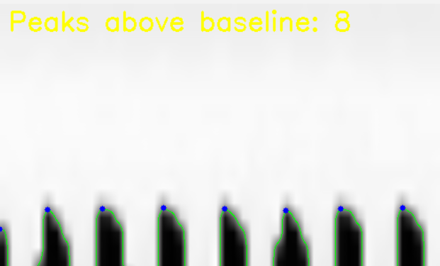

As the frequency increases, the number of peaks is also increased. When the frequency is 4.45Hz, the number of peaks is below 9. The number of peaks is between 10 and 13 when the frequency is about 6.63Hz and more than 13 when the frequency is about 7.75Hz.


## Results and Analysis

#### A. Model Evaluation

1. **PSNR **
   - Peak Signal-to-Noise Ratio between the magnified image and the original image
   - The loss information on the image quality of the generated or compressed image is evaluated as an index. The higher the value, the less the loss.

$$
MSE={{\Sigma_{M,N}[I_1(m,n)-I_2(m,n)^2]}\over{M*N}}
$$

$$
PSNR=10log_{10}\bigg({R^2\over MSE}\bigg)
$$

2. **SSIM**
   * Structural Similarity Index Map is a method designed to evaluate differences in human visual quality rather than numerical errors.
   * SSIM evaluates quality in three aspects: Luminance, Contrast, and Structural.
     * C1=(0.01*L).^2, where L is the specified DynamicRange value.
     * C2=(0.03*L)/^2, where L is the specified DynamicRange value.
     * C3=C2/2 

$$
SSIM(x,y)=[I(x,y)]^\alpha \cdot[c(x,y)]^\beta \cdot [s(x,y)]^\gamma={{(2\mu_x\mu_y+C_1)(2\sigma_{xy}+C_2)}\over{(\mu_x^2+\mu_y^2+C_1)(\sigma_x^2+\sigma_y^2+C_2)}}
$$

$$
I(x,y)={{2\mu_x\mu_y+C_1}\over{\mu_x^2+\mu_y^2+C_1}}
$$

$$
c(x,y)={{2\sigma_x\sigma_y+C_2}\over{\sigma_x^2+\sigma_y^2+C_2}}
$$

$$
s(x,y)={{\sigma_{xy}+C_3}\over{\sigma_x\sigma_y+C_3}}
$$

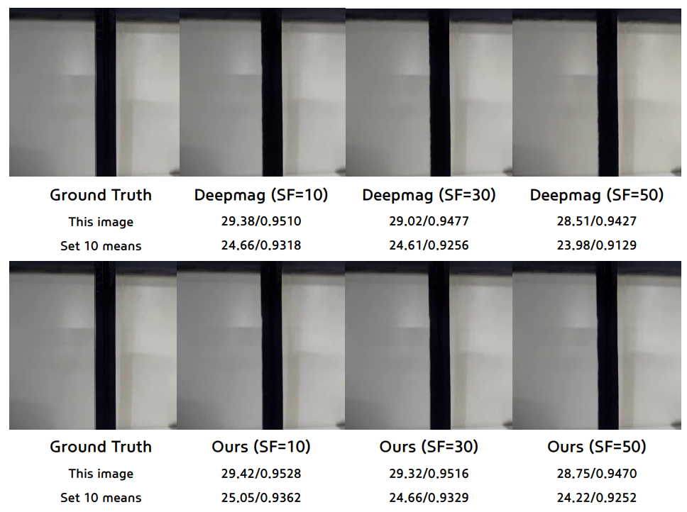

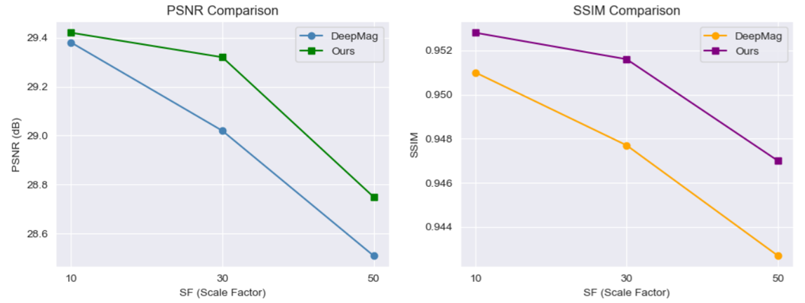


#### B. Visual Results

Magnified vibration video creates a larger amplitude xt-slice image. It allows to analyze the frequency of the vibration with image processing. With accelerometer, we calculated the frequency of every vibration of motor with a certain PWM rate. The operation of motor and accelerometer, and calculating frequency code is included in the [Link](https://github.com/Joungbin-C/DLIP/blob/main/Final_Project/Report/Vibration%20data%20generation%20and%20frequency%20determination.pdf)

| PWM  | Frequency [Hz] |
| :--: | :------------: |
|  80  |      4.45      |
| 100  |      6.63      |
| 120  |      7.75      |

Since the wave form of each frequency has same number of peaks in a regular interval, we count the number of peak in fixed range of frame. When operating frequency is about 4.45Hz, which is the normal state of operating DC motor,  the peaks are less than 8. When peaks are between 10 to 12, it is about 6.63Hz which is the state of warning. When peaks are more than 13, it is about 7.75Hz which is the state of emergency.


**Demo**: 

[Magnified_Vibration_Video](https://youtu.be/ZRDsUGpkqfA)

[Counting_Peaks_Video](https://youtu.be/1zQY_ZBroPE)


#### C. Project Objective Achievement Summary

|                        **Objective**                         | Achievement                                                  |     Status      |
| :----------------------------------------------------------: | :----------------------------------------------------------- | :-------------: |
| 1. Develop a deep learning-based model for <br />vibration magnification | - Constructed dataset using `Xa`, `Xb` and optical flow-based `Y`<br />- Achieved PSNR > 25.0, SSIM > 0.9 | &#9989;Achieved |
|     2. Visualize vibration using motion-magnified videos     | \- Amplified videos show clearly observable vibration patterns<br/>\- Subtle motions are visible to human eye | &#9989;Achieved |
|   3. Perform XT-slice visualization from magnified videos    | \- Generated XT-slice images from ROI<br/>\- Periodic motion patterns visible in XT-domain | &#9989;Achieved |
| 4. Detect frequency and vibration state <br />via classical image processing | \- Detected edges and peaks in XT images<br/>\- Classified normal/warning/emergency states based on peak count | &#9989;Achieved |


### Guide

Before start training and real time detection, download all the `.py` code from [this GitHub](https://github.com/Joungbin-C/DLIP/tree/main/Final_Project/Code). After download python files, download and open Jupyter notebook files, which are also located in GitHub. Process the `Train_maginification.ipynb` first and `real_time_detection.ipynb` lastly. 


**Train Code**

```python
import torch

device = torch.device("cuda" if torch.cuda.is_available() else "cpu")

video_path = "video/speed80.mp4"
output_dir = "data/frames_sample/"
```

Activate cuda to train with GPU. Next, make sure you have a video. If you have, change the `video_path` which you want to extract the frame for training dataset. `output_dir` is the path to save the extracted images.

```python
from creating_dataset import *

extract_frames_from_video(video_path, output_dir, prefix="sample", every_nth=1)
```

Use the `extract_frames_from_video` function from `creating_dataset`. The video is captured by every frame of that video, which is loaded by the `cap.read()`.

```python
frame_dir = "data/frames_sample"
xa_dir = "data/training_data/L/Xa"
xb_dir = "data/training_data/L/Xb"

prepare_xa_xb_pairs(frame_dir, xa_dir, xb_dir, step=1)

generate_Y_with_optical_flow(xa_dir, xb_dir, "data/training_data/L/Y", sf=50.0)
```

To prepare the `Xa` and `Xb` datasets,  `prepare_xa_xb_pairs` function from  `creating_dataset` is used. That function reshape the image into [3, 224, 224] to fit on the model structure. Additionally, images are transformed and saved as PIL images. 

with those `Xa` and `Xb` datasets, Y datasets are creating by `generate_Y_with_optical_flow` function. In this function, the pixel flow is calculated by `calcOpticalFlowFarneback` from `cv` library. After normalization, the scale factor is multiplied within the pixel flow. Then, magnified image sets are created. 

```python
from magnification_model import *

model = MagnificationModel().to(device)

input_Xa = torch.randn(1, 3, 224, 224).to(device)
input_Xb = torch.randn(1, 3, 224, 224).to(device)
SF = torch.tensor(20.0).to(device)

summary(model, input_data=(input_Xa, input_Xb, SF), col_names=["input_size", "output_size", "num_params"], depth=3)
```

For the magnification model, we read the essay, named  *Learning-based video motion magnification*, and created the code ourselves. It is on the `magnification_model.py` and you can see the summary.

```python
from training import train

model = MagnificationModel()
device = "cuda" if torch.cuda.is_available() else "cpu"

train(
    model=model,
    xa_dir="data/training_data/L/Xa",
    xb_dir="data/training_data/L/Xb",
    y_dir="data/training_data/L/Y",
    device=device,
    num_epochs=15,
    batch_size=4,
    save_path="model/best_magnification_model_L.pth"
)
```

Train with all datasets and the model. The `train` function is on the `training.py`.


**Real Time Detection Code**

```python
from real_time_detection import *

magnification_model = load_magnification_model("model/best_magnification_model_L.pth", DEVICE)

run_detection_loop(SOURCE, magnification_model, SF)
```

To visualize the real time detection, load all functions from `real_time_detection.py` and load the model, which is trained from above. Lastly, use `run_detection_loop` function to visualize the real time detection. 

The `real_time_detection.py` include `process_xt_images` which is used to extract the horizontal pixels of certain height and stack them to create XT images. The horizontal pixels of the vibrating beam will create the waveform. 

The function `analyze_peaks` uses contours method to find the peaks of the wave and those numbers are the scale of the vibrational frequency. We calculate the frequencies with the accelerometer and matched them with the waveform which has a certain number of peaks. For example, the waveform, which has less than the 8 peaks,  is about 4.45Hz. 


## Reference

* Oh, T.-H., Jaroensri, R., Kim, C., Elgharib, M., Durand, F., Freeman, W. T., & Matusik, W. (2018). *Learning-based video motion magnification*. In Proceedings of the European Conference on Computer Vision (ECCV) (pp. 633–648).
* https://m.blog.naver.com/mincheol9166/221771426327
